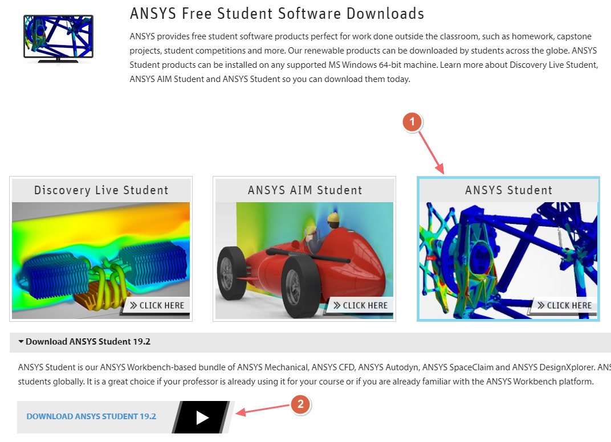
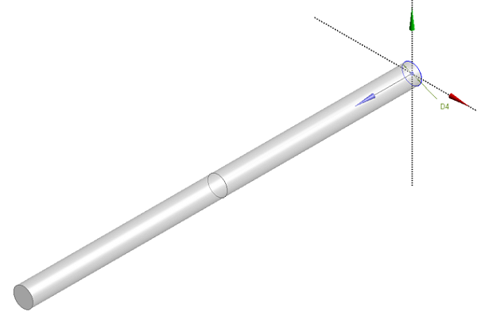
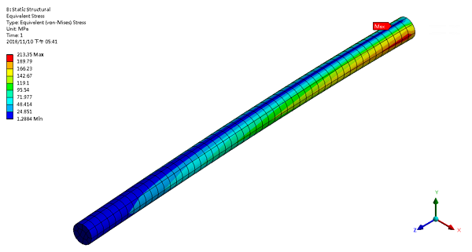
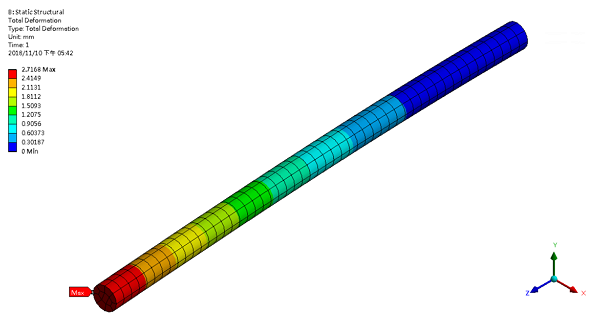
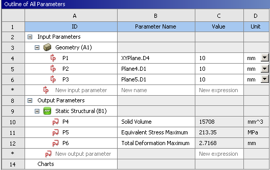
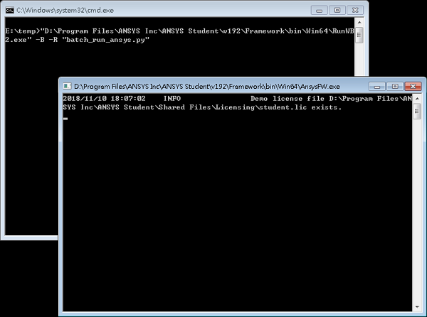
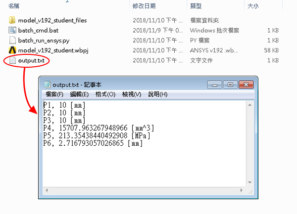

# ANSYS Workbench Batch Mode

A demo example for using ANSYS Workbench batch mode with Python scripting in **ANSYS Student v19.2** .

[TOC]

## 1. Introduction

This example is only used for academic purpose. We demonstrate how to use batch mode with Python script to change the ANSYS Workbench's parameters (or variables), then update the simulation and export results to a text file.

## 2. Install ANSYS Student

The ANSYS Student Software provide a twelve-month renewable license which is limited with 32k nodes/elements in Structure Analysis, 512k nodes/cells in Fluid Analysis. You can 
download it from the website : https://www.ansys.com/academic/free-student-products



## 3. Example

### 3.1. Files

The **example.zip** contains four items which include following files/folder:

- model\_v192\_student.wbpj
- model\_v192\_student\_files/
- batch\_run\_ansys.py
- batch\_cmd.bat

The .wbpj should only be opened in ANSYS Student v19.2 or newer version.

### 3.2. Model Description

In this model, we construct a cantilever beam which has three sections as shown in Figure 1. Each section has a circle sketch and uses the diameter as the design variables.

|  |
| :-: |
| *Figure 1: bar* |


In structural simulation, we fixed one end of the beam and apply a 100 \[N\] force (+x) on the other side. The stress and deformation distribution are shown in Figure 2 and 3. Then we can retrieve the response values to Parameter Set Table, as shown in Figure 4.

| |
| :-: |
| *Figure 2: Stress Distribution* |

|  |
| :-: |
| *Figure 3: Displacement Distribution* |

|  |
| :-: |
| *Figure 4: Parameter Set* |

### 3.3. Batch Mode

#### 3.3.1. `batch_run_ansys.py`

```python
# encoding: utf-8
# -- open wbpj
Open(FilePath="E:/temp/model_v192_student.wbpj")
```

You need to modify the project file's location in code line 3 before running the batch mode. This file path might be different in your computer.

```python
# -- setup parameter value
p1 = Parameters.GetParameter(Name="P1")
p2 = Parameters.GetParameter(Name="P2")
p3 = Parameters.GetParameter(Name="P3")

p1.SetQuantityUnit("mm")
p2.SetQuantityUnit("mm")
p3.SetQuantityUnit("mm")

dp0 = Parameters.GetDesignPoint(Name="0")
dp0.SetParameterExpression(Parameter=p1, Expression="10")
dp0.SetParameterExpression(Parameter=p2, Expression="10")
dp0.SetParameterExpression(Parameter=p3, Expression="10")
```

Then you can decide which parameter should be changed and modify the value by the "Expression" argument.

```python
# -- write out result
fileIO = open("E:/temp/output.txt","w")

for parameter in Parameters.GetAllParameters():
    value = parameter.Value.ToString()
    fileIO.write(parameter.Name + ", " + value + "\n")
    fileIO.flush()
 
fileIO.close()
```

After updating the project. Use Python file I/O function to write out the parameter's information to a text file.

#### 3.3.2. `batch_cmd.bat`

```ms-dos
"D:\Program Files\ANSYS Inc\ANSYS Student\v192\Framework\bin\Win64\RunWB2.exe" -B -R "batch_run_ansys.py"
```

The first part of this .bat file is the path of ANSYS WB program, and the arguement means running the program with batch\_run\_ansys.py in batch mode. This two files (batch\_run\_ansys.py and batch\_cmd.bat) should be placed in the same folder.

After executing the batch\_cmd.bat. It will appear two MS-DOS windows as shown in Figure 5, and create output.txt when it finished. The output.txt will contain the parameter's information of the project file.

|  |
| :-: |
| *Figure 5: MS-DOS windows*|

|  |
| :-: |
| *Figure 6: output.txt* |

For the detailed operation procedure, please check the video : https://www.youtube.com/watch?v=jGWYmR0uqtU
